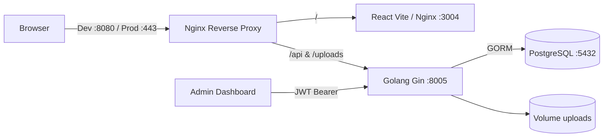

# Portal Berita Reportase Foto

Monorepo portal berita visual dengan Golang (Gin + GORM), React (Vite + TypeScript + Tailwind), PostgreSQL, Docker Compose, dan Nginx.

## Arsitektur



- Pada development, seluruh layanan termasuk reverse proxy berjalan lewat `docker-compose.yml`.
- Pada production, PostgreSQL, backend, dan frontend berjalan dalam container; Nginx Host OS menangani TLS wildcard dan meneruskan trafik hanya ke port loopback `3004` serta `8005`.
- Upload disimpan pada bind mount host dan disajikan backend melalui `/uploads`.
- Dashboard mengautentikasi admin dengan JWT, sedangkan endpoint baca berita bersifat publik.

## Arah visual

Antarmuka publik menggunakan bahasa desain yang terinspirasi dari ritme dan komposisi `sditarrahmah.sch.id`: navigasi putih yang ringkas, hero terpusat, aksen ungu, latar lavender lembut, deretan foto, kartu beradius halus, statistik overlay, serta CTA pastel. Konten, identitas merek, dan aset situs referensi tidak disalin; pola tersebut diadaptasi khusus untuk portal reportase foto.

## Struktur

```text
.
├── backend/
│   ├── cmd/api/main.go
│   ├── internal/{config,database,handlers,middleware,models,routes,services}/
│   ├── uploads/
│   ├── Dockerfile
│   └── Dockerfile.dev
├── frontend/
│   ├── src/{components,context,lib,pages,types}/
│   ├── Dockerfile
│   ├── Dockerfile.dev
│   └── nginx.conf
├── nginx/
│   ├── dev/nginx.conf
│   └── prod/reportase.conf
├── docker-compose.yml
├── docker-compose.prod.yml
└── .env.example
```

## Development

1. Salin environment: `cp .env.example .env`.
2. Ganti `JWT_SECRET`, `DB_PASSWORD`, dan `ADMIN_PASSWORD`.
3. Jalankan: `docker compose up --build`.
4. Frontend langsung: `http://localhost:3004`.
5. API langsung: `http://localhost:8005/api`.
6. Reverse proxy development: `http://localhost:8080`.
7. Login admin: `http://localhost:3004/admin/login` memakai `ADMIN_EMAIL` dan `ADMIN_PASSWORD`.

PostgreSQL dipetakan ke host port `5434` untuk menghindari benturan dengan instalasi lokal; komunikasi antarkontainer tetap memakai port `5432`.

## Production

1. Set `.env` dengan `GO_ENV=production`, domain HTTPS pada `FRONTEND_URL`, dan secret acak yang kuat.
2. Jalankan container aplikasi: `docker compose -f docker-compose.prod.yml up -d --build`.
3. Container hanya bind ke loopback host: frontend `127.0.0.1:3004`, backend `127.0.0.1:8005`.
4. Salin `nginx/prod/reportase.conf` ke konfigurasi Nginx Host OS dan ganti domain serta path sertifikat.
5. Uji lalu reload: `sudo nginx -t && sudo systemctl reload nginx`.

### Wildcard SSL Let's Encrypt

Wildcard membutuhkan DNS-01 challenge. Contoh dengan plugin DNS yang sesuai provider:

```bash
sudo certbot certonly --dns-<provider> -d example.com -d '*.example.com'
```

Jangan gunakan placeholder tersebut secara literal. Ikuti plugin resmi provider DNS, lalu arahkan `ssl_certificate` dan `ssl_certificate_key` pada konfigurasi production ke hasil Certbot.

## Endpoint API

Publik:
- `GET /api/news?page=1&limit=9&search=...&category=...`
- `GET /api/news/:slug`

Admin:
- `POST /api/admin/login`
- `GET /api/admin/me`
- `GET /api/admin/news`
- `GET /api/admin/news/:id`
- `POST /api/admin/news`
- `PUT /api/admin/news/:id`
- `DELETE /api/admin/news/:id`
- `POST /api/admin/uploads` (`multipart/form-data`, field `image`)

## Catatan keamanan

- Jangan commit `.env`.
- Gunakan JWT secret minimal 32 karakter acak.
- Ganti kredensial bootstrap admin sebelum deploy pertama.
- Upload dibatasi berdasarkan ukuran, ekstensi, dan MIME sniffing; Nginx juga membatasi request body.
- Port aplikasi production bind ke loopback sehingga hanya Nginx Host OS yang mengekspos layanan.
